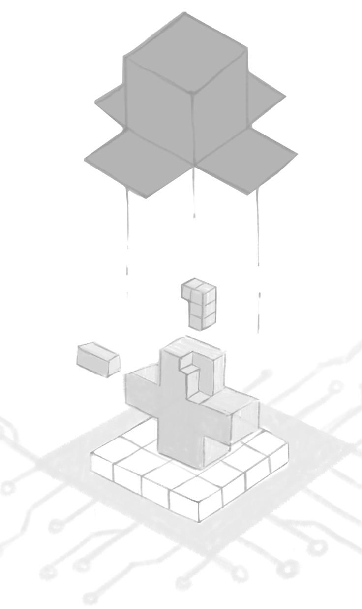

Eric Topol, MD, is a classically trained clinician who fights for the patient and their rights as the atomic unit of healthcare, made crystal clear with his book "The Patient Will See You Now."

His Precision Medicine Initiative, funded by NIH, is out to make hyper-personalized medical care for all of us, all under the umbrella of open science, open data, open outcomes for all humans. Here are 5 key takeaways from our chat.

---

"Open source is fundamental. The fact that we don't have open healthcare reflects the deepness of our problem"

### 1. Put the Patient in the Driver’s Seat
Everyone's medical record is full of errors. Wrong diagnoses, wrong medications. It's never been edited. The patient knows best about what actual medicines they’re taking or not taking, or whether there are erroneous diagnoses. Again, the input of the human being, the driver of the care team, is not taken into account.

### 2. A National Standard
Data should not be put into a siloed environment in proprietary software systems. Let's go back to when the US put forty billion dollars towards health information technology adoption, when they never had the teeth to tell companies, whether it be Epic or Cerner or Allscripts and all the others, that we all need common data requirements and standards that are completely open and transparent, that lead to a more seamless data source. Why didn't we do that? What is the problem in this country, where we don’t force all companies that are active in Health IT to have these standards. Only in recent times have we seen a bit of a push towards that, but it's taking seemingly forever to get there. We want each individual's data from prenatal all the way throughout their life. All these things need to be accessible so that any healthcare clinician, with the patient's consent, will have access to all this data instantaneously. Your life data and its easy availability for the care team is what we should aspire to and eventually achieve.

### 3. Follow the Leader
We can take lessons from [Estonia](https://en.wikipedia.org/wiki/Estonia), where each individual citizen owns their health and personal data. If each person owned their data, many would want to share it with their clinicians. They would be very interested in having that data be used for research, which would help people with similar medical conditions, or patients will just help altruistically. The Estonian model is being adopted in many other countries. Here in the US, we have this erratic, proprietary, closed model. Data ownership is fundamental because more and more of that data is being generated by the individual, with sensors, with phones, with genomic data.

20 million people have consumer genomic data that they have purchased themselves. And yet, that's not going to be assimilated into an electronic health record anytime soon. In addition to the increased to genomics and sensor data, there will be more and more lab testing as well.

The inflection point in data collection is here, where the doctor-maintained, aging electronic record, what used to be the paper record, is now only a small piece of your overall health picture.

Consumer smartphones with higher and higher quality cameras will perform retinal and skin exams. This is a fundamental shift from the hallowed electronic record to all these other sources of health data about the individual that are equally as important, with even larger data sets.

### 4. AmazonCare
Amazon is getting much more serious about entering healthcare because they already have the customer interface. They just purchased Pill Pack to deliver prescriptions to all 50 states. They have 70% of the country on Prime for rapid delivery. Those subscribers are trying to get their money’s worth out of their annual fee.

Amazon, along with Berkshire Hathaway and JP Morgan, are set up and poised to make a difference. Amazon is a consumer-friendly platform, has very deep knowledge in the use of AI, with one of the early precedents of using AI for what merchandise any given individual might want or need. With AI taking center stage on your growing Amazon data, the triad of companies will have access to huge health data... and it's just getting bigger.

There are unlimited opportunities. Every individual should own their data, but that’s probably not where Atul is going. They're trying to reduce costs and improve outcomes. Specifically, getting rid of the middle people like pharmacy benefit managers, that are taking money out of the system, without providing any improvement in efficiency.

It'll be interesting to see how Atul Gawande and the crew advances healthcare. You can’t make it any worse.

### 5. A Call for Open Source
I'm a big advocate for open everything, open to the 10th power. I think this is one of the major healthcare system deficiencies. We have to own our data. All of our data. It's hard to access, and even harder to pull the data out from proprietary electronic health records in a usable form. We have anti-open source.
